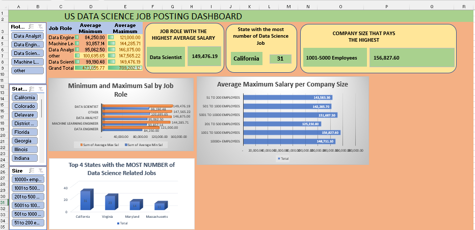

# Step 1
- Use the Worksheet on Uncleaned DS Jobs and Transform Tables
- Analyze Salary Data
- Salary by Role
- Count by State
- Salary by Company Size

# Step 2
- State with the most Data Science jobs
- Job role with the highest (Complete the dashboard)
- Company size that pays the highest salary (Complete the dashboard)
- Sector employing the least and most Data Science-related jobs
- Sector with the minimum and maximum average salary
- Note: Create a PIVOT Table query for sector-based insights

# Step 3
- Create Necessary Pivot Tables & Charts
- Use appropriate visualizations for reports
- Insert Slicers for: Role Type, Company Size, State.
- Insert Map (Optional).

# Dashboard Screenshot

# Salary By Role Screenshot

# Count By State Screenshot

# Salary By Company Size Screenshot

# Sector By Salary Screenshot

# Sector By Size Screenshot

# Map Screenshot

